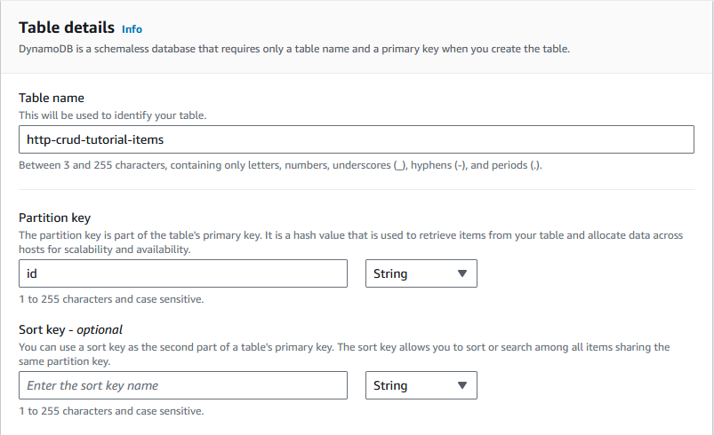
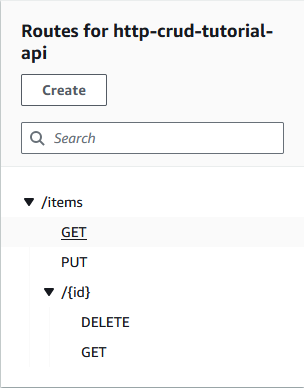
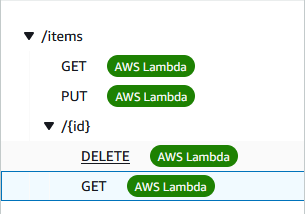
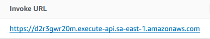
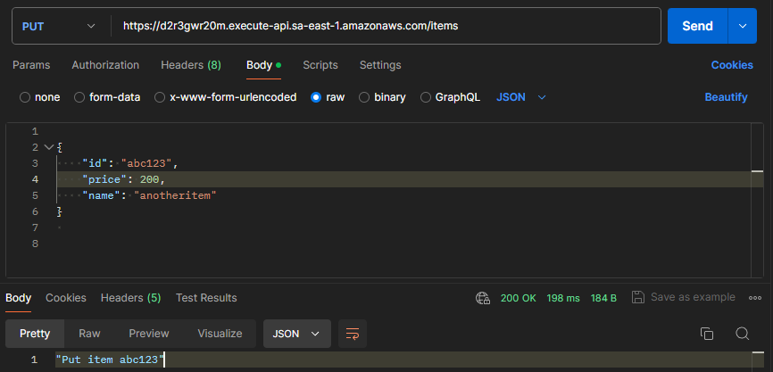
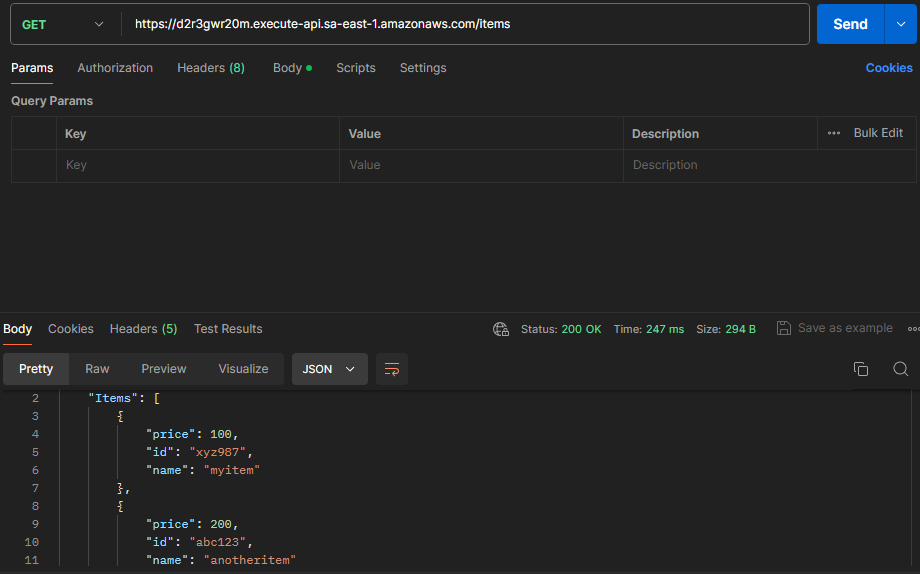
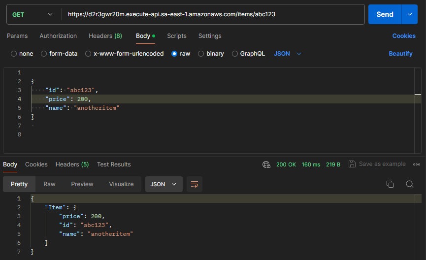

# Progress Report CRUD API
Neste repositório estão as anotações feitas ao longo do workshop de API CRUD da AWS.

# CRUD API
O objetivo do workshop é de implementar uma **API CRUD (Create, Read, Update, Delete)**. A API será construída utilizando o [DynamoDB](https://aws.amazon.com/pt/dynamodb/) e o [AWS Lambda](https://aws.amazon.com/pt/lambda/) .

### 1. Criando uma tabela no DynamoDB
Para criar uma tabela no DynamoDB devemos:
1. Abrir o console DynamoDB em https://console.aws.amazon.com/dynamodb/
2. Escolher a opção _Create table_
3. Especificar o nome da tabela e sua chave primária



### 2. Criar uma função Lambda
Devemos agora criar a função Lambda que irá criar, ler, atualizar e deletar itens do DynamoDB. A função usa eventos da [Amazon API Gateway](https://docs.aws.amazon.com/apigateway/latest/developerguide/http-api-develop-integrations-lambda.html#http-api-develop-integrations-lambda.proxy-format) para determinar como interagir com o DynamoDB.

Para criar a função Lambda:
1. Faça o login no Lambda console em https://console.aws.amazon.com/lambda 
2. Selecione _Create function_
3. Selecione _Author from scratch_
4. Especifique o nome da função
5. Em _Runtime info_, selecione a versão Node.js 16.x
6. Em Permissions selecione _Change default execution role_
7. Selecione _Create a new role from AWS policy templates_
8. Especifique o nome da role
9. Em _Policy templates_, escolha _Simple microservice permissions_. Essa política concede permissão à função Lambda para interagir com o DynamoDB
10. Substitua o conteúdo de `index.js` por

```javascript
const AWS = require("aws-sdk");

const dynamo = new AWS.DynamoDB.DocumentClient();

exports.handler = async (event, context) => {
  let body;
  let statusCode = 200;
  const headers = {
    "Content-Type": "application/json"
  };

  try {
    switch (event.routeKey) {
      case "DELETE /items/{id}":
        await dynamo
          .delete({
            TableName: "http-crud-tutorial-items",
            Key: {
              id: event.pathParameters.id
            }
          })
          .promise();
        body = `Deleted item ${event.pathParameters.id}`;
        break;
      case "GET /items/{id}":
        body = await dynamo
          .get({
            TableName: "http-crud-tutorial-items",
            Key: {
              id: event.pathParameters.id
            }
          })
          .promise();
        break;
      case "GET /items":
        body = await dynamo.scan({ TableName: "http-crud-tutorial-items" }).promise();
        break;
      case "PUT /items":
        let requestJSON = JSON.parse(event.body);
        await dynamo
          .put({
            TableName: "http-crud-tutorial-items",
            Item: {
              id: requestJSON.id,
              price: requestJSON.price,
              name: requestJSON.name
            }
          })
          .promise();
        body = `Put item ${requestJSON.id}`;
        break;
      default:
        throw new Error(`Unsupported route: "${event.routeKey}"`);
    }
  } catch (err) {
    statusCode = 400;
    body = err.message;
  } finally {
    body = JSON.stringify(body);
  }

  return {
    statusCode,
    body,
    headers
  };
};
```
11. Selecione _Deploy_ para atualizar a função

### 3. Criando uma API HTTP
APIs HTTP nos possibilita criar APIs RESTful com baixa latência e menor custo do que APIs REST. Podemos usar APIs HTTP para enviar requisições para funções AWS Lambda ou para qualquer endpoint HTTP roteável publicamente.

Para criar a API HTTP:
1. Acesse o console API Gateway em https://console.aws.amazon.com/apigateway 
2. Clique em _Create API_
3. Na opção HTTP API, clique em _Build_
4. Especifique o nome da API
5. Clique em _Next_
6. Em _Configure routes_, escolha _Next_. Podemos configurar as rotas posteriormente
7. Clique em _Create_

### 4. Criando as rotas
As rotas são a maneira que enviamos requisições da API para o backend. Rotas são compostas de duas partes: o método HTTP e o _path_ para o recurso desejado.

Neste exemplo, vamos criar quatro rotas: 
1. **GET** ``/items/{id}`` 
2. **GET** ``/items`` 
3. **PUT** ``/items`` 
4. **DELETE** ``/items/{id}`` 

Para criar as rotas:
1. Acesse o console API Gateway em https://console.aws.amazon.com/apigateway 
2. Selecione a API
3. Selecione _Routes_
4. Selecione _Create_
5. Preencha os campos _route_ e _method_ com os especificados acima 



### 5. Criando uma integração
Criamos uma integração para conectar uma rota aos recursos de backend. Em um passo posterior, iremos vincular essas integrações à uma rota. No exemplo desta API, criamos uma integração Lambda que usamos para todas as rotas.

Para criar a integração:
1. Acesse o console API Gateway em https://console.aws.amazon.com/apigateway 
2. Selecione a API 
3. Clique em _Integrations_
4. Clique em _Manage integrations_ e depois em _Create_
5. Ignore _Attach this integration to a route_, por enquanto. Podemos fazer isso posteriormente
6. Em _Integration type_, escolha _Lambda function_
7. Em _Lambda function_, coloque o nome da função Lambda que criamos anteriormente
8. Clique em _Create_


### 6. Vinculando as integrações à rotas
Após vincularmos essas integrações às rotas da API, nossa função Lambda é invocada quando o cliente chama alguma das rotas.

Para vincular a integração às rotas:
1. Acesse o console API Gateway em https://console.aws.amazon.com/apigateway 
2. Selecione a API 
3. Clique em __Integrations__
4. Escolha a rota
5. Em _Choose an existing integration_, escolha a integração que criamos 
6. Repita esse processo para todas as rotas

As rotas que estão vinculadas a alguma integração ficam dessa forma



### 7. Testando a API
Para testar a API, vamos utilizar o Postman.

Basta colar a URL disponível no https://console.aws.amazon.com/apigateway no campo _Invoke URL_



Resultado dos testes: 

- PUT `/items`:


- GET `/items`:


- GET `/items/{id}`



